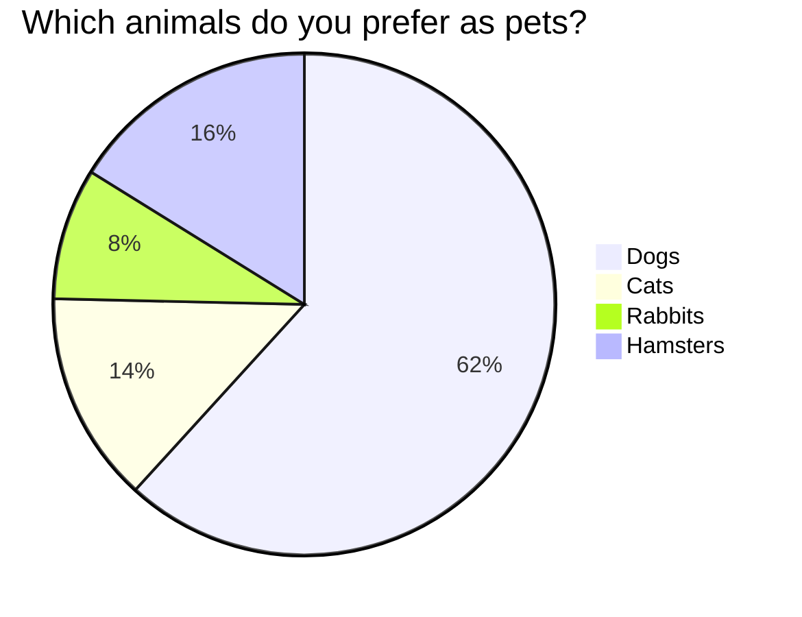
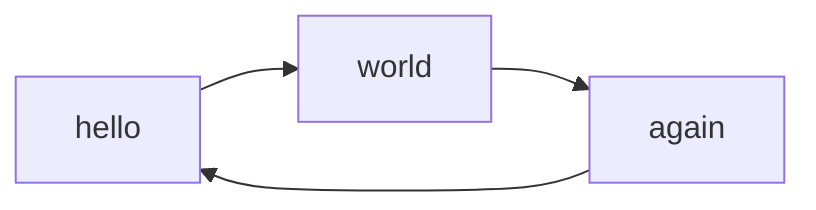

# Webové aplikace 3. hodina

naucili jsme se html znacky `<b>` a `<p>` a ted je muzem pouzivat.


```mermaid
pie title Which animals do you prefer as pets?
    "Dogs" : 386
    "Cats" : 85
    "Rabbits" : 53
    "Hamsters" : 101
```


```mermaid
graph LR
    hello --> world
    world --> again
    again --> hello
```


```python
a = random()
print(a)
```
